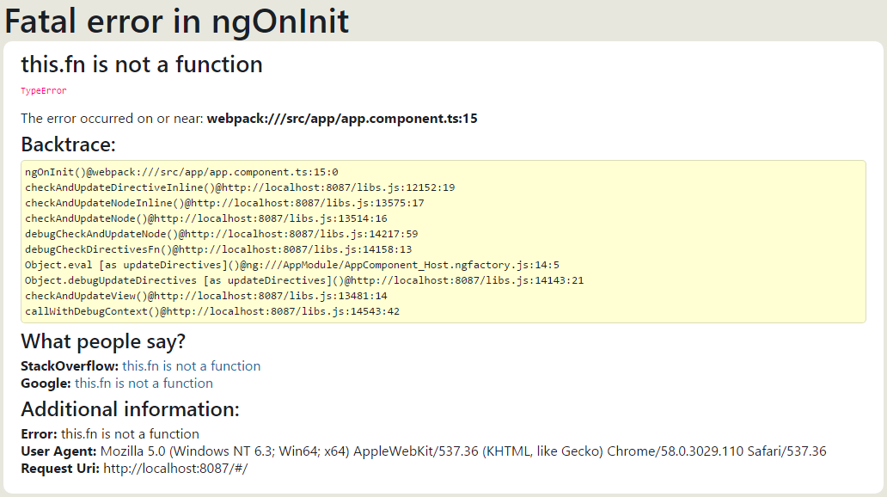

dev-error-handler
---
Expose global angular error handler to screen.


USAGE
---
1. Install `npm i @epam/dev-error-handler`
2. Import `DevErrorHandler`
```ts
import { ErrorHandler } from '@angular/core';
import { DevErrorHandler } from '@epam/dev-error-handler';
```
3. Configure dependency injection
```ts
{ provide: ErrorHandler, useClass: DevErrorHandler }
```
